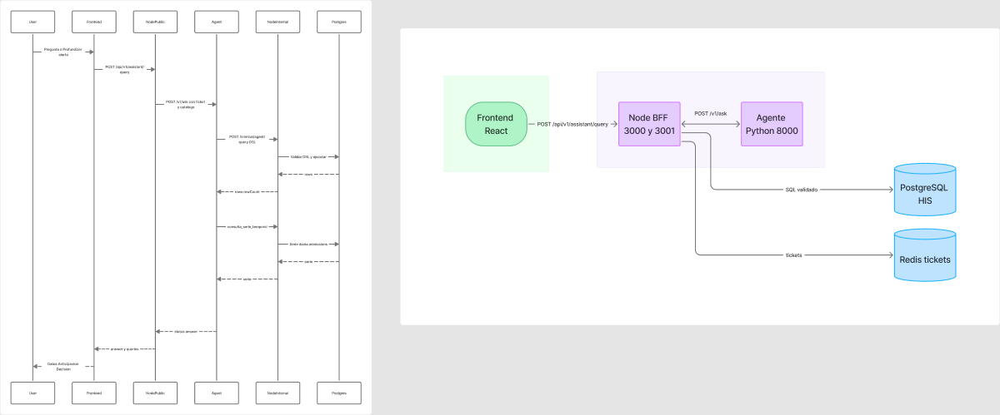
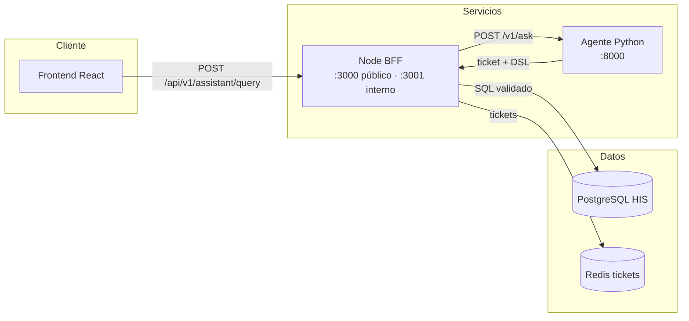
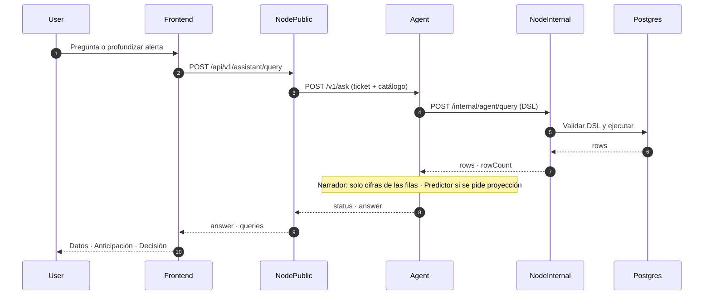

# Susana-AI — Hospital Intelligence

Documentación principal del monorepo del hackathon **Hospital Intelligence**
(Hospital Susana López de Valencia).

Este archivo es la **guía de entrada**: qué es el sistema, cómo encajan las
piezas, cómo levantarlo, qué hace el agente IA/ML, cómo autenticarse y dónde
está cada cosa. Los detalles finos del agente viven en `agent/`; el frontend
tiene su propio README en la rama/carpeta `frontend/`.

---

## 1. Qué es

Plataforma de **inteligencia operativa hospitalaria**:

- Panel de ocupación, esperas, demanda, farmacia, cirugías y analítica
- Motor de **alertas** con reglas sobre métricas reales
- **Asistente IA** que responde en lenguaje natural con datos del HIS
- Predicción (Random Forest) y recomendaciones operativas
- Auth + RBAC + auditoría: el hospital controla quién ve qué

Principio de diseño (innegociable):

> **Node tiene toda la autoridad.** El agente Python solo *propone* consultas
> en un DSL JSON. Node valida, autoriza, ejecuta contra PostgreSQL y audita.
> El agente **nunca** ejecuta SQL ni toca la base directamente.

---

## 2. Arquitectura principal

Diseño de referencia (secuencia + componentes) en FigJam:

**[Agente Hospital Intelligence — secuencia y arquitectura](https://www.figma.com/board/5XE6rZuQFlOQedlwHzcYEK/Agente-Hospital-Intelligence---secuencia)**



Tres capas claras:

| Capa | Componentes | Responsabilidad |
|------|-------------|-----------------|
| **Cliente** | Frontend React (`:5173` / Vercel) | UI; nunca habla con DB ni con el agente |
| **Servicios** | Node BFF (`:3000` + `:3001`) · Agente Python (`:8000`) | Auth, RBAC, tickets; el agente propone DSL y razona (ML) |
| **Datos** | PostgreSQL HIS · Redis | Solo Node escribe SQL validado y gestiona tickets |

### Vista de componentes (alineada al FigJam)



| Pieza | Carpeta | Puerto | Rol |
|-------|---------|--------|-----|
| Node BFF | `src/` | `:3000` / `:3001` | Auth, RBAC, DSL→SQL, alertas, CRUD HIS |
| Agente IA/ML | `agent/` | `:8000` | NLU + Planner DSL + Narrador verificado + Predictor (RF) |
| Frontend | `frontend/` | `:5173` | Dashboard, alertas, chat |
| Datos | `prisma/`, `data/raw/` | — | Esquema e import HIS |

**Stack:** Node ≥22 · Express 5 · Prisma 6 · PostgreSQL · Redis · Better Auth · FastAPI · scikit-learn · React 19 · Vite · Tailwind v4.

---

## 3. Secuencia de una pregunta

Flujo real del asistente (mismo diagrama del FigJam). El usuario pregunta o
**profundiza una alerta**; la respuesta cierra con *dato → anticipación → decisión*.



En el agente: **NLU** (tema, unidad, periodo, filtros) → **Planner** (DSL con valores reales del
catálogo) → Node ejecuta → **Narrador** (solo cifras de las filas, alcance y fecha de corte) →
**Predictor** si se pide proyección (Random Forest si ≥12 puntos; si no, promedio reciente).

| Paso | Endpoint | Auth |
|------|----------|------|
| Usuario → Node | `POST /api/v1/assistant/query` | Sesión + `Origin` |
| Node → Agente | `POST /v1/ask` | `X-Internal-Key` = `AGENT_API_KEY` |
| Agente → Node | `POST /internal/agent/query` | `x-internal-key` = `INTERNAL_API_KEY` |

### Qué NO hace el agente

- No ejecuta SQL ni abre Postgres
- No es autoridad de datos (Node valida el DSL)
- RF se entrena **por consulta** en memoria (sin modelo en disco)
- Camino `/v1/ask` actual: planner determinístico (sin OpenRouter)

Detalle y vista interna: [`agent/DIAGRAMA_FLUJO.md`](agent/DIAGRAMA_FLUJO.md) ·
[`agent/DIAGRAMA_AGENTE_AI_ML.md`](agent/DIAGRAMA_AGENTE_AI_ML.md).

---

## 4. Módulos del backend (`src/modules/`)

| Módulo | Qué cubre |
|--------|-----------|
| `users` / `roles` / `permissions` / `audit` | Identidad, RBAC, auditoría |
| `health` | Liveness / readiness / startup |
| `alerts` | Motor de reglas, job, ack/resolve, reglas en BD |
| `assistant` | Puente al agente + API interna DSL |
| `dashboard` | Resumen, ocupación, esperas, demanda |
| `analytics` | Servicios, triage, exportaciones |
| `medications` | Catálogo, stock, dispensaciones |
| `surgeries` | Analítica de cirugías |
| `patients`, `admissions`, `triages`, `service-records`, `procedures`, `surgery-schedules` | CRUD HIS |
| `imports` | Carga masiva CSV (`POST /imports/:table`) |
| `his` | Importador y derivados desde extractos |

~**93 endpoints** propios documentados en `openapi.json` /
`GET /api/v1/openapi.json`. Auth Better Auth vive en `core/auth/` (no hay
`modules/auth/`).

---

## 5. Datasets del asistente

El agente solo puede pedir datos de estos datasets (filtrados por permiso del
usuario):

| Dataset | Tabla | Permiso | Uso típico |
|---------|-------|---------|------------|
| `alerts` | `alerts` | `alerts:read` | Alertas abiertas / severidad (con filtro de ámbito) |
| `admissions` | `his_admissions` | `services:read` | Ingresos, ocupación, esperas, predicción de demanda |
| `services` | `his_service_records` | `services:read` | Servicios/procedimientos prestados |
| `medications` | `his_medication_dispenses` | `medications:read` | Dispensaciones (código, no nombre) |
| `surgeries` | `his_surgery_schedules` | `surgeries:read` | Conteos de programación (sin serie temporal rica) |

Definición: `src/modules/assistant/assistant.catalog.ts`.

---

## 6. Permisos y roles (RBAC)

Formato: `recurso:accion`. Fuente de verdad: `src/core/rbac/permissions.ts`.

Grupos principales: `users`, `roles`, `permissions`, `audit`, `system`,
`dashboard`, `analytics`, `assistant`, `medications`, `alerts`, `services`,
`surgeries`, `patients`, `data` (`import` / `manage`).

Roles de sistema (semilla): `SUPER_ADMIN`, `ADMIN`, `DIRECTOR`,
`JEFE_SERVICIO`, `FARMACIA`, `ANALISTA`, `CONSULTA`.

Reglas importantes:

- Sin escalada de privilegios (guardas en `core/rbac/guards.ts`)
- Alertas filtradas por **ámbito** (ej. FARMACIA solo ve `medication`)
- Lecturas de pacientes se auditan (`patients:read` es sensible)
- Comodín `*` solo para superadmin efectivo

---

## 7. Arranque local (los 3 procesos)

### Requisitos

- Node ≥22, Docker (Postgres + Redis) o instancias locales
- Python 3.11+ (agente real)
- Claves alineadas entre raíz `.env` y `agent/.env`

### 7.1 Infra + API Node

```bash
cp .env.example .env
# Generar BETTER_AUTH_SECRET con buena entropía y pegarlo en .env

docker compose up -d postgres redis
npm install
npm run db:migrate && npm run db:seed:dev
npm run dev
# → API pública :3000 + API interna del agente :3001
```

En el `.env` de la **raíz** (para el agente real):

```env
AGENT_URL=http://127.0.0.1:8000
AGENT_API_KEY=<igual que agent/.env AGENT_API_KEY>
INTERNAL_API_KEY=<igual que agent/.env NODE_INTERNAL_API_KEY>
```

Sin `AGENT_URL`, `/assistant/query` responde `503`. Stub sin Python:

```bash
npm run agent:mock   # mismo contrato en :8000
```

**Datos HIS** (dashboard, ocupación, asistente con datos reales): no vienen en
el seed. Coloca extractos en `data/raw/*.txt` (carpeta ignorada por git) y:

```bash
npm run data:import   # idempotente
npm run test:real     # opcional: verifica conteos vs archivos crudos
```

### 7.2 Agente Python

```bash
cd agent
python -m venv .venv
# Windows:
.venv\Scripts\activate
pip install -r requirements.txt
copy .env.example .env
# Alinear AGENT_API_KEY y NODE_INTERNAL_API_KEY con el .env de Node
uvicorn app.main:app --reload --port 8000
```

Flujo, garantías y tests del agente: [`agent/README.md`](agent/README.md) ·
tareas AI: [`agent/TAREAS.md`](agent/TAREAS.md).

### 7.3 Frontend

```bash
# Rama frontend (o carpeta local sincronizada)
cd frontend
cp .env.example .env   # VITE_API_URL=http://localhost:3000/api/v1
npm install
npm run dev            # :5173
```

Detalle UI: `frontend/README.md`. En producción el front suele ir a **Vercel**;
API + agente + Postgres/Redis en el host del equipo backend.

### 7.4 Producción API (PM2)

```bash
npm run build
pm2 start ecosystem.config.js --env production
```

Ver [`ecosystem.config.js`](ecosystem.config.js).

---

## 8. Variables de entorno clave

Lista completa y comentada: `.env.example` (falla al arrancar si falta algo
crítico o es inseguro).

| Variable | Qué hace |
|----------|----------|
| `BETTER_AUTH_SECRET` | Secreto de sesiones (obligatorio, alta entropía) |
| `DATABASE_URL` / `REDIS_URL` | Postgres y Redis |
| `AUTH_PUBLIC_SIGNUP` | `false` por defecto: sin autoregistro hospitalario |
| `AGENT_URL` | URL del Python; sin ella, asistente en `503` |
| `AGENT_API_KEY` | Node → agente (`X-Internal-Key`) |
| `INTERNAL_API_KEY` | Agente → Node interno; **distinta** de la anterior |
| `AGENT_TIMEOUT_MS`, `AGENT_QUERY_TIMEOUT_MS` | Timeouts red / SQL |
| `AGENT_MAX_QUERIES_BASIC/ADVANCED`, `AGENT_MAX_ROWS` | Cupos por ticket |
| `INTERNAL_HOST`, `INTERNAL_PORT`, `INTERNAL_ALLOWED_IPS` | Puerto interno |
| `ASSISTANT_RATE_LIMIT_MAX` / `INTERNAL_RATE_LIMIT_MAX` | Rate limits |
| `ALERT_*` | Umbrales del motor de alertas |
| `CORS_ORIGINS` | Orígenes permitidos (local + URL Vercel) |
| `COOKIE_SECURE`, `TRUST_PROXY` | Producción detrás de proxy HTTPS |
| `SEED_ADMIN_EMAIL` / `SEED_ADMIN_PASSWORD` | Superadmin del seed |
| `SEED_TEST_USERS` | Crea director/farmacia de prueba (solo no-prod) |

Agente (`agent/.env`): `AGENT_API_KEY`, `NODE_INTERNAL_URL`,
`NODE_INTERNAL_API_KEY`, opcionales de LLM si se usan rutas legacy.

---

## 9. Scripts npm

| Comando | Qué hace |
|---------|----------|
| `npm run dev` | API con recarga (:3000 + :3001) |
| `npm run build` / `npm start` | Compila a `dist/` y arranca |
| `npm run lint` / `typecheck` | Calidad (0 errores es el criterio) |
| `npm test` | Unit + módulos + seguridad |
| `npm run test:coverage` | Cobertura |
| `npm run test:e2e` | HTTP real por recurso (`hospital_e2e`) |
| `npm run test:real` | Conteos HIS vs `.txt` en `hospital_local` |
| `npm run db:migrate` / `db:deploy` | Migraciones Prisma |
| `npm run db:seed:dev` | Permisos, roles, superadmin, users de prueba |
| `npm run db:studio` / `db:purge` | Explorador / limpieza de sesiones |
| `npm run data:import` | Importa HIS desde `data/raw/` |
| `npm run agent:mock` | Stub del agente en `:8000` |
| `npm run audit:prod` | Falla si hay CVE alta en deps de producción |

---

## 10. Mapa de endpoints

### Autenticación (Better Auth)

Toda `{API_PREFIX}/auth/**` la sirve Better Auth desde `core/auth/auth.ts`.
Contrato vivo: **`GET /api/v1/auth/reference`**.

| Método | Ruta | Uso |
|--------|------|-----|
| POST | `/api/v1/auth/sign-up/email` | Registro (bloqueado si `AUTH_PUBLIC_SIGNUP=false`) |
| POST | `/api/v1/auth/sign-in/email` | Login |
| POST | `/api/v1/auth/sign-out` | Logout |
| GET | `/api/v1/auth/get-session` | Sesión actual |
| GET | `/api/v1/users/me` | Perfil |
| POST | `/api/v1/auth/two-factor/verify-totp` | Segundo factor MFA |

No hay *refresh* rotativo: la sesión se renueva sola (`updateAge`).

### Negocio (~93 endpoints en `openapi.json`)

| Área | Rutas / capacidad | Permiso base |
|------|-------------------|--------------|
| Users / roles / permissions / audit | CRUD + `GET /audit/:id` | `users:*` / `roles:*` / `permissions:read` / `audit:read` |
| Patients | CRUD; sin `birthDate` en salida; lectura auditada | `patients:read` / `data:manage` |
| Admissions | CRUD + first-care | `services:read` / `data:manage` |
| Triages, service-records, procedures, surgery-schedules | CRUD HIS | ámbito lectura + `data:manage` |
| Medications | Catálogo, stock, dispensaciones | `medications:read`/`manage` |
| Alerts | Listado, ack, resolve, manual, reglas `GET/PATCH /alerts/rules/:type` | `alerts:*` / `system:manage` en reglas |
| Imports | `POST /imports/:table` (202 + job), plantillas, sondeo | `data:import` |
| Assistant | `POST /assistant/query` | `assistant:use` (+ `advanced`) |
| Dashboard / analytics / surgeries | Paneles y export CSV | `dashboard:read`, `analytics:*` |
| Health | `/health`, `/ready`, `/startup` | público |

### API interna del agente (NO pública)

| Método | Ruta | Puerto | Auth |
|--------|------|--------|------|
| POST | `/internal/agent/query` | `:3001` | IP allowlist + `x-internal-key` + rate limit |

Nunca se monta en `:3000` ni en `openapi.json`.

### Contrato del agente Python

| Método | Ruta | Auth |
|--------|------|------|
| GET | `/health` | — |
| POST | `/v1/ask` | `X-Internal-Key` = `AGENT_API_KEY` |

---

## 11. Cómo autenticarse

### Cookie (web / frontend)

Las mutaciones exigen cabecera `Origin` (CSRF):

```bash
curl -c cookies.txt -X POST localhost:3000/api/v1/auth/sign-in/email \
  -H 'Content-Type: application/json' \
  -d '{"email":"admin@hospital-intelligence.dev","password":"..."}'

curl -b cookies.txt -H 'Origin: http://localhost:5173' \
  localhost:3000/api/v1/users/me
```

### Bearer (móvil o servicio a servicio)

El login devuelve el token en `set-auth-token`:

```bash
TOKEN=$(curl -si -X POST localhost:3000/api/v1/auth/sign-in/email \
  -H 'Content-Type: application/json' \
  -d '{"email":"admin@hospital-intelligence.dev","password":"..."}' \
  | awk -F': ' '/^set-auth-token/{print $2}' | tr -d '\r')

curl -H "Authorization: Bearer $TOKEN" localhost:3000/api/v1/users/me
```

### Pregunta al asistente (ejemplo)

```bash
curl -b cookies.txt -H 'Origin: http://localhost:5173' \
  -H 'Content-Type: application/json' \
  -X POST localhost:3000/api/v1/assistant/query \
  -d '{"question":"¿Cómo se ve la ocupación de urgencias la próxima semana?"}'
```

---

## 12. Usuarios de prueba

Con `SEED_TEST_USERS=true` (desarrollo; `env.ts` lo prohíbe en producción):

| Correo | Rol | Contraseña |
|--------|-----|------------|
| valor de `SEED_ADMIN_EMAIL` | `SUPER_ADMIN` | `SEED_ADMIN_PASSWORD` |
| `director@hospital.test` (o `SEED_DIRECTOR_EMAIL`) | `DIRECTOR` | `SEED_TEST_PASSWORD` |
| `farmacia@hospital.test` (o `SEED_FARMACIA_EMAIL`) | `FARMACIA` | `SEED_TEST_PASSWORD` |

Nota: Resend en sandbox solo entrega a la cuenta propia; no esperes correo
real a todos los usuarios de prueba sin dominio verificado.

---

## 13. Añadir un módulo Node

1. Crea `src/modules/<dominio>/` con `routes`, `controller`, `service`,
   `schemas` (y `mapper` si hay campos sensibles).
2. El `*.routes.ts` se monta solo (autoload); el prefijo = nombre de carpeta.
3. Declara permisos nuevos en `core/rbac/permissions.ts`.
4. `npm run db:seed:dev`.
5. **No** crees `modules/auth/`.

---

## 14. Tests

| Comando | Qué corre | Base de datos |
|---------|-----------|---------------|
| `npm test` | `tests/unit/`, `tests/modules/`, `tests/security/` | `DATABASE_URL` |
| `npm run test:real` | Conteos y derivados vs `.txt` crudos | `hospital_local` + `data:import` |
| `npm run test:e2e` | Servidor real + HTTP real | `E2E_DATABASE` (`hospital_e2e`) |

Fuera de suite automática: envío real de correo (Resend) y calidad de un
agente/LLM real (E2E usa stub).

---

## 15. Seguridad (resumen)

Controles clave (detalle en [`SECURITY.md`](SECURITY.md)):

| Control | Dónde |
|---------|-------|
| No-escalada de privilegios | `core/rbac/guards.ts` |
| Hashing scrypt | `core/security/password.ts` |
| Sesiones + MFA TOTP | Better Auth |
| CSRF por `Origin` | middleware de seguridad |
| Rechazo de contraseñas filtradas (HIBP) | plugin HaveIBeenPwned |
| Auditoría append-only | trigger PostgreSQL |
| Agente sin SQL directo | DSL validado en Node `:3001` |
| Puerto interno aislado | allowlist IP + clave distinta |

### Antes de desplegar

- `BETTER_AUTH_SECRET` con entropía real
- `REDIS_URL` obligatoria
- `COOKIE_SECURE=true`, `CORS_ORIGINS` solo https
- `TRUST_PROXY` = saltos reales del reverse proxy
- `AGENT_API_KEY` ≠ `INTERNAL_API_KEY`, rotadas
- Frontend (Vercel) + API/agente/DB en infra del equipo

Reportar vulnerabilidades: ver [`SECURITY.md`](SECURITY.md) (no abrir issue
público).

---

## 16. Mapa de documentación

| Documento | Contenido |
|-----------|-----------|
| **Este `README.md`** | Documentación principal del monorepo (empieza aquí) |
| [`PRESENTACION.md`](PRESENTACION.md) | Guión del pitch + 4 preguntas oficiales del reto |
| [`docs/presentacion/index.html`](docs/presentacion/index.html) | Diapositivas profesionales (abrir en navegador, tecla F) |
| [`agent/README.md`](agent/README.md) | Arranque rápido del agente |
| [`agent/README.md`](agent/README.md) | Arranque, flujo y garantías del agente Python |
| [`agent/DIAGRAMA_FLUJO.md`](agent/DIAGRAMA_FLUJO.md) | Arquitectura + secuencia (espejo del FigJam) |
| [FigJam arquitectura](https://www.figma.com/board/5XE6rZuQFlOQedlwHzcYEK/Agente-Hospital-Intelligence---secuencia) | Diseño visual de secuencia y componentes |
| [`docs/diagrams/arquitectura-figjam.png`](docs/diagrams/arquitectura-figjam.png) | Captura del board integrada en §2 |
| [`agent/DIAGRAMA_AGENTE_AI_ML.md`](agent/DIAGRAMA_AGENTE_AI_ML.md) | Secuencia interna AskService → NLU → Planner → Node → Narrador |
| [`agent/TAREAS.md`](agent/TAREAS.md) | Estado del trabajo del equipo AI |
| [`frontend/README.md`](frontend/README.md) | UI React (rama/carpeta frontend) |
| [`SECURITY.md`](SECURITY.md) | Política de reporte y garantías |
| `openapi.json` / `GET /api/v1/openapi.json` | Contrato vivo de la API de negocio |
| `.env.example` / `agent/.env.example` | Variables comentadas |

---

## 17. Estructura rápida del repo

```
Susana-AI/
├── README.md                 ← estás aquí (doc principal)
├── PRESENTACION.md           ← guión del pitch
├── SECURITY.md
├── docs/diagrams/            ← captura FigJam de arquitectura
├── ecosystem.config.js       ← PM2 producción
├── package.json
├── prisma/                   ← schema + migraciones + seed
├── src/
│   ├── core/                 ← auth, rbac, http, middleware, openapi
│   ├── modules/              ← dominio (alerts, assistant, HIS, …)
│   └── scripts/              ← import HIS, purge, …
├── agent/                    ← FastAPI + ML
│   ├── app/bridge/           ← ask_service, nlu, planner, dsl, narrator, llm, node_client
│   ├── app/agent/            ← predictor
│   ├── tests/                ← pytest (catálogo real exportado de Node)
│   └── DIAGRAMA_*.md
├── frontend/                 ← React (rama frontend / local)
├── tests/
├── data/raw/                 ← extractos HIS (gitignored)
└── scripts/agent-mock.mjs
change
```

---

## Licencia / contexto

Proyecto de hackathon *Hospital Intelligence*. El backend actúa como único
intermediario autorizado entre el frontend y el agente IA.
