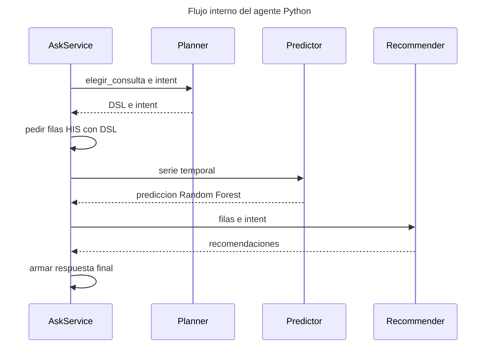

# Flujo interno del agente (solo Python)

Secuencia **solo del agente**: sin Frontend, sin Node, sin Postgres.

FigJam: https://www.figma.com/board/zKWWfUzEp21UySfBaEoHSk

## Modulos

| Participante | Archivo | Rol |
|--------------|---------|-----|
| AskService | `bridge/ask_service.py` | Orquesta todo y arma la respuesta |
| Planner | `bridge/dsl_planner.py` | DSL + intent |
| Predictor | `agent/predictor.py` | Random Forest / tendencia |
| Recommender | `agent/recommender.py` | Decisiones operativas |
