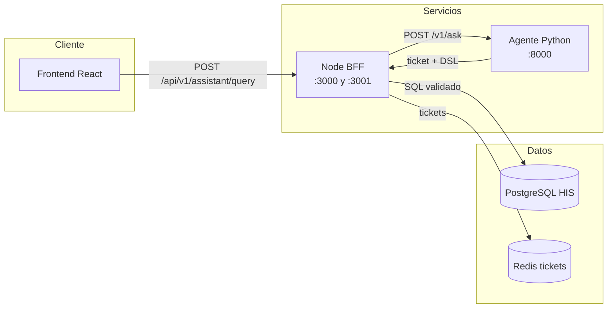
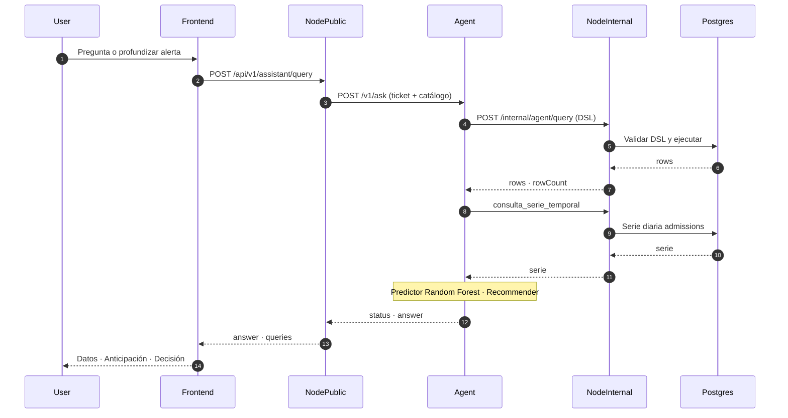
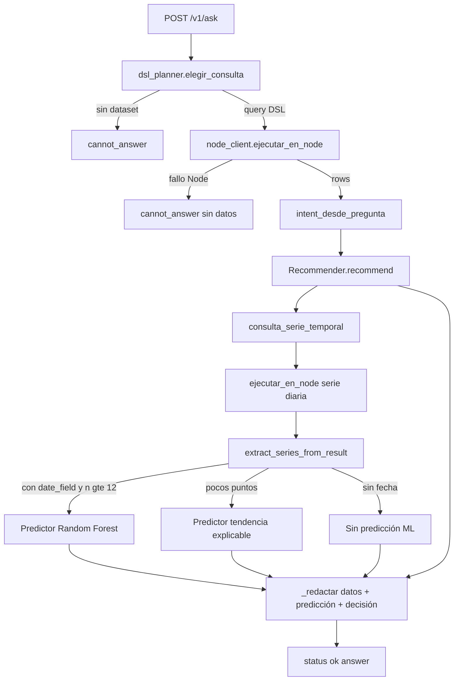

# Diagrama del Agente — Hospital Intelligence

**Fuente visual (diseño del equipo):**  
[FigJam — secuencia y arquitectura](https://www.figma.com/board/5XE6rZuQFlOQedlwHzcYEK/Agente-Hospital-Intelligence---secuencia)

Captura integrada en el README: [`docs/diagrams/arquitectura-figjam.png`](../docs/diagrams/arquitectura-figjam.png).

Código de verdad: `Susana-AI/agent` + contrato Node (`/v1/ask`, puerto interno `:3001`).

---

## 1. Arquitectura (quién habla con quién)

Misma estructura del tablero FigJam: **Cliente** · **Servicios** · **Datos**.

---

## 2. Secuencia de una pregunta (flujo real)

---

## 3. Interior del agente (`handle_ask`)

---

## Contratos clave

| Paso | Endpoint | Auth |
|------|----------|------|
| Usuario | `POST /api/v1/assistant/query` | Sesión cookie + Origin |
| Node → Agente | `POST /v1/ask` | `X-Internal-Key` = `AGENT_API_KEY` |
| Agente → Node | `POST /internal/agent/query` | `x-internal-key` = `INTERNAL_API_KEY` |
| Health | `GET /health` agente · `GET /api/v1/health/ready` Node | — |

## Qué NO hace el agente

- No ejecuta SQL directo
- No llama a OpenRouter en el camino actual de `/v1/ask` (planner determinístico)
- No es autoridad de datos: Node valida el DSL y ejecuta contra Postgres
- Random Forest se entrena **por consulta** sobre la serie HIS (no modelo persistido en disco)
