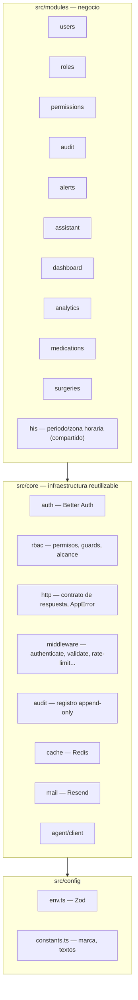

# Arquitectura

## Capas: `modules → core → config`



`core/` nunca importa de `modules/`. Un módulo nuevo = una carpeta con sus 4
archivos (`routes/controller/service/schemas`); `*.routes.ts` se monta solo
vía autoload y el prefijo sale del nombre de la carpeta.

---

## Pipeline de middlewares (`src/app.ts`)

Orden exacto, y por qué no puede reordenarse a la ligera:

```
1.  requestContext          → genera requestId, lo usa todo lo demás
2.  pinoHttp                → logging (ignora /health)
3.  helmet                  → CSP 'none' (API JSON, no ejecuta scripts)
4.  cors                    → origin = CORS_ORIGINS, credentials: true
5.  compression             → filtra respuestas con Cache-Control: no-store (mitiga BREACH)
6.  Better Auth (toNodeHandler)  → ANTES de leer el body: su handler consume el stream crudo
7.  requireJson              → 415 si hay body y no es application/json (justo antes de json())
8.  express.json             → limit: BODY_LIMIT
    cookieParser
9.  healthRouter             → montado ANTES del rate limit (un 429 en liveness reinicia el pod)
10. globalRateLimit          → techo por IP para toda la API
11. verificarOrigen          → CSRF por origen, cierra en fallo, para el resto de la API
12. autoload de módulos      → *.routes.ts bajo src/modules
13. notFoundHandler
14. errorHandler
```

`express.urlencoded` se retira: con `requireJson` forzando JSON, era código
muerto. Better Auth va antes del parser porque, si un parser genérico lee el
body primero, a Better Auth le llega vacío y todo responde 400 — es el error
de integración más común de la librería.

---

## Dos puertos: público e interno

El agente Python nunca tiene autoridad ni credenciales de base de datos.
Node valida y ejecuta todo; Python solo *propone* consultas.

```
Puerto público (PORT, todas las interfaces)   Puerto interno (INTERNAL_HOST:INTERNAL_PORT, 127.0.0.1 por defecto)
┌───────────────────────────────────────┐     ┌──────────────────────────────────────────┐
│ helmet · cors · verificarOrigen        │     │ soloRedInterna   → net.BlockList sobre    │
│ globalRateLimit · autoload de módulos  │     │                    INTERNAL_ALLOWED_IPS,  │
│                                         │     │                    lee req.socket.remote  │
│ POST /api/v1/assistant/query           │     │                    Address (NUNCA req.ip   │
│   authenticate → validate →            │     │                    ni X-Forwarded-For)     │
│   assistant:use → assistantRateLimit   │     │ internalRateLimit → por IP                 │
└───────────────────────────────────────┘     │ requireInternalKey → sha256 + timingSafeEqual│
                                                │                    contra INTERNAL_API_KEY  │
                                                │ requireJson · express.json({limit:'64kb'}) │
                                                │ POST /internal/agent/query                 │
                                                └──────────────────────────────────────────┘
```

El puerto interno (`src/internal-app.ts`) **no** pasa por el autoload de
`src/app.ts` a propósito: nunca debe poder montarse en el puerto público. Sin
`INTERNAL_API_KEY`, ese servidor no arranca (cierra en fallo).

---

## Flujo del agente

```
React ──HTTPS──► Node :3000  POST /api/v1/assistant/query
                   (authenticate → validate → assistant:use → assistantRateLimit)
                    │
                    │ 1. datasets = catálogo lógico ∩ permisos del usuario
                    │ 2. ticket = 32 bytes aleatorios, TTL AGENT_TICKET_TTL_SECONDS,
                    │    cupo N consultas, ligado al usuario (Redis, solo se guarda el hash)
                    ▼
                  Python   POST {AGENT_URL}/v1/ask   X-Internal-Key: AGENT_API_KEY
                    │ recibe: pregunta, ticket, catálogo LÓGICO (sin tablas/columnas reales), límites
                    │ 3. propone 0..N consultas en un DSL JSON (dataset, metrics, groupBy, filters...)
                    ▼
                  Node :3001 (127.0.0.1)   POST /internal/agent/query   X-Internal-Key: INTERNAL_API_KEY
                    │ 4. IP permitida → rate limit → clave → ticket válido y con cupo
                    │ 5. valida el DSL contra los datasets del USUARIO del ticket
                    │ 6. SQL parametrizado (Prisma.sql), identificadores solo del catálogo,
                    │    transacción READ ONLY, statement_timeout
                    │ 7. guarda el resultado bajo el ticket y lo devuelve a Python
                    ▼
                  Python devuelve {status, answer}   (texto no confiable, validado con Zod, ≤4000 car.)
                    ▼
Node responde a React: answer + las filas que NODE ejecutó (nunca las que dice Python)
                        · revoca el ticket · audita assistant.query
```

Dos claves distintas, una por sentido (`AGENT_API_KEY` Node→Python,
`INTERNAL_API_KEY` Python→Node): filtrar una no habilita el sentido
contrario. Detalle de seguridad completo en `docs/security.md`.

---

## Mapa de módulos

| Módulo | Estado | Qué hace |
|---|---|---|
| `users`, `roles`, `permissions`, `audit`, `health` | hecho | identidad, RBAC administrativo, auditoría, liveness/readiness |
| `his` | hecho | no es un recurso HTTP propio: `his.periodo.ts` es el contrato compartido de "periodo" (`desde`/`hasta`, `fechaReferencia()`, zona horaria `America/Bogota`) que consumen `dashboard`, `analytics`, `medications` y `assistant` |
| `dashboard` | hecho | `/dashboard/summary`·`/occupancy`·`/wait-times`·`/demand`: ocupación (estimada, sin fecha de egreso en el HIS), espera de triage, demanda, alertas abiertas filtradas por ámbito |
| `analytics` | hecho | `/analytics/services`·`/triage` (+ export CSV); reusa `wait-time.service.ts` de `dashboard` |
| `medications` | hecho | catálogo, consumo, riesgo de agotamiento (`'insufficient_data'` sin stock) y `PUT /medications/:code/stock` (lo único que FARMACIA escribe del dominio HIS) |
| `surgeries` | hecho | `/analytics/surgeries` (basePath forzado, montado junto a `analytics`): resumen de `SurgerySchedule`, sin FK real (B0), `executed` verificado solo cuando hay ingreso en el extracto |
| `alerts` | hecho | motor de reglas puro (`alerts.engine.ts`) + `sincronizar` sobre umbrales de `env.ALERT_*`; filtra por ámbito (medicamento/servicio/triage/cirugía) según permisos. `alerts.metrics.ts` lo alimenta con las métricas reales de `dashboard`/`medications`/`surgeries`; `alerts.job.ts` evalúa al arrancar y cada `ALERT_EVAL_INTERVAL_MINUTES`; `POST /alerts/evaluate` (`alerts:manage`) lo dispara a mano |
| `assistant` | hecho | ruta pública `/assistant/query` + API interna `/internal/agent/query`; catálogo de 5 datasets (`alerts` + 4 del HIS: `admissions`, `services`, `medications`, `surgeries`), DSL, tickets |
| `core/agent/client.ts`, `core/middleware/internal.ts` | hecho | cliente HTTP hacia Python y guardas del puerto interno |

Datos reales del HIS: importados en `hospital_local` con `npm run
data:import` (idempotente) desde `data/raw/*.txt`, ignorado por git. Modelo
completo, hallazgos del análisis (B0) y qué garantiza `npm run test:real`:
`docs/database.md`.

mTLS entre Node y el puerto interno **no** se implementa en el MVP: la
protección es de red (bind a 127.0.0.1 + IP allowlist) más la clave
compartida. Un sidecar o service mesh es la vía si hace falta más adelante.
